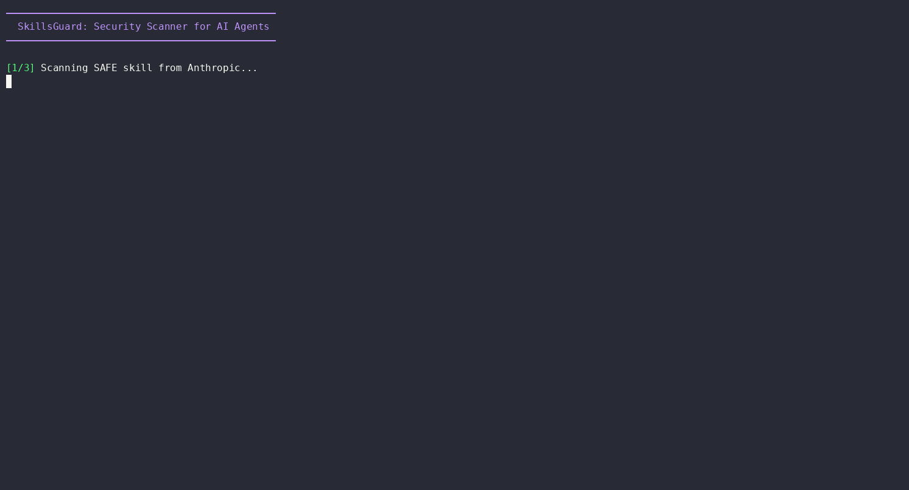

# SkillsGuard Demo

## 1-Minute Demo



This demo shows:
1. Scanning a safe skill from Anthropic's official skills repo
2. Detecting threats in a malicious test skill
3. Auditing all local skill directories

### Recording

To re-record:
```bash
python3 -m asciinema rec 1min-demo.cast -c "bash 1min-demo.sh"
agg 1min-demo.cast 1min-demo.gif
```

### Manual Demo

Run the demo script directly:
```bash
bash demo/1min-demo.sh
```
